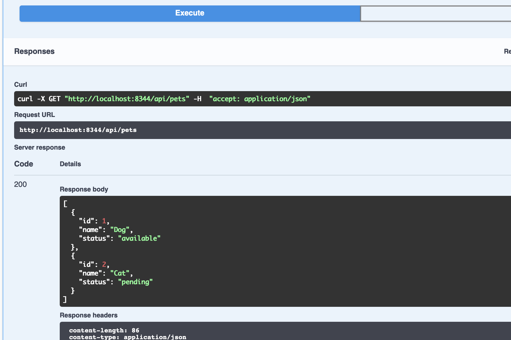

# Serve Swagger-UI for your Go app's APIs

I have a simple requirement:

* to host a [swagger-ui](https://github.com/swagger-api/swagger-ui) for my Go app's REST APIs

Main porpose is not only to provide API documentation, but also to use API console to execute the APIs.

However, it's not a simple task to find an existing and simple solution.

Until the most recent [commit](https://github.com/go-openapi/runtime/commit/5fc6d7931327cf2e35c6f68b24964af682789b15) of openapi, it becomes simple finally.

## Intro

This repo is a simplest demo to serve a swagger-ui for you REST APIs. Just

1. Download the code.
2. `go run main.go`
3. Visit `http://localhost:8344/docs`
4. Enjoy it.

## Screenshot

## A bit explantion

* It's achieved with the `SwaggerUI` API in "github.com/go-openapi/runtime/middleware"
* The `simplepetstore` is copied from https://github.com/go-openapi/runtime/tree/master/internal/testing/simplepetstore. It provides the "/swagger.json" endpoint.